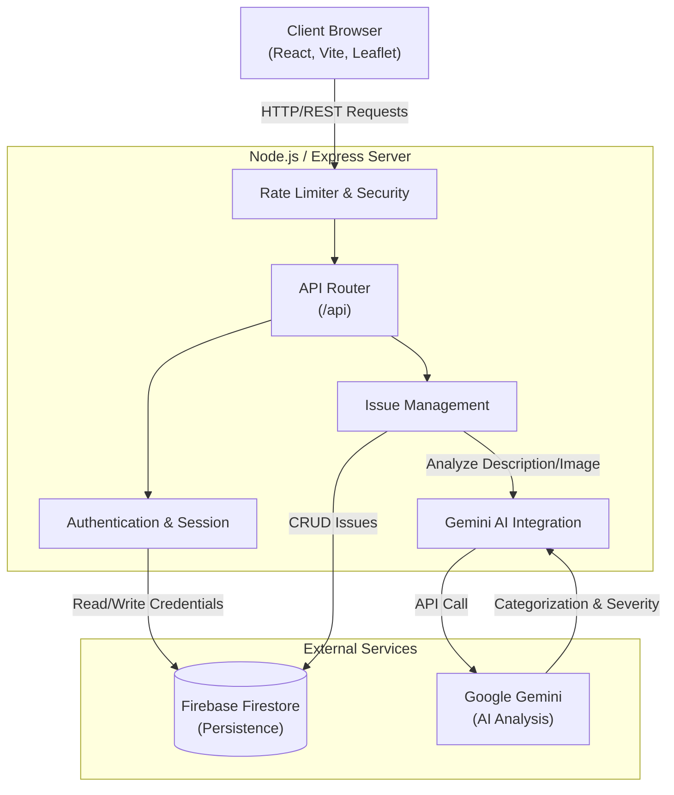
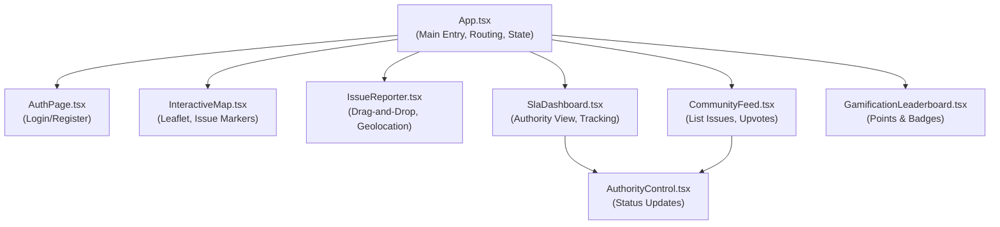
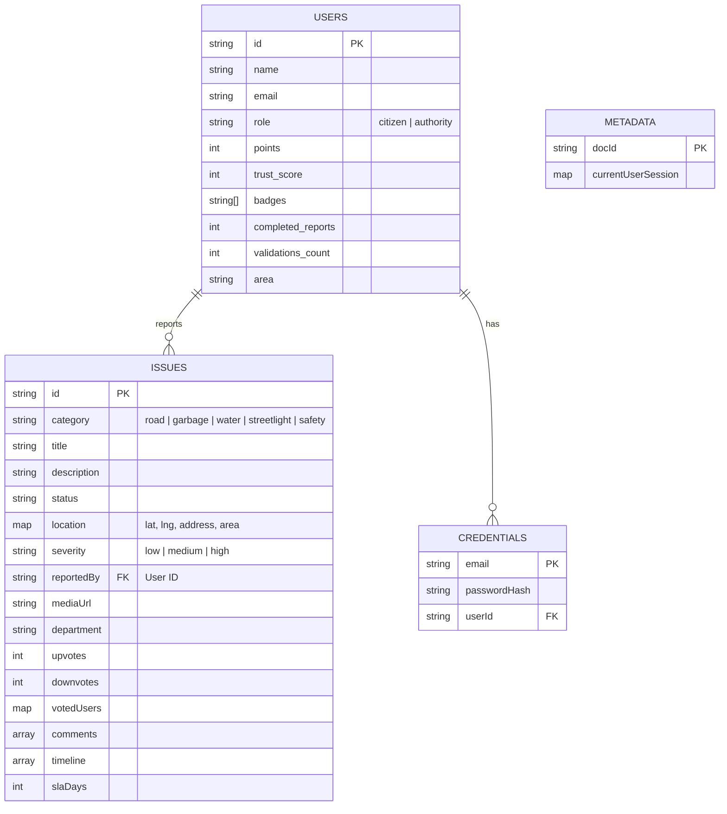
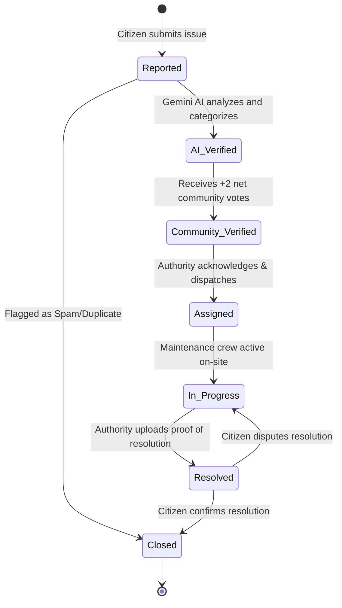

# Civic Intelligence Engine - Architecture & Data Flow

This document provides a graphical overview of the **Civic Intelligence Engine**, visualizing its system architecture, component tree, database schema, and the lifecycle of a civic issue.

## 1. High-Level System Architecture

This diagram illustrates how the frontend React application communicates with the Node.js/Express backend, which in turn orchestrates data persistence with Firebase Firestore and intelligent analysis with the Gemini AI model.

## 2. Frontend Component Architecture

The React frontend is composed of modular components handling different aspects of the civic platform.

## 3. Database Schema (Firestore Collections)

The backend stores data in Firebase Firestore across several collections. This Entity-Relationship diagram maps out the core data structures and their relationships.

## 4. Issue Lifecycle (State Machine)

A civic issue goes through multiple stages from the moment it is reported by a citizen to its final resolution by a municipal authority.

